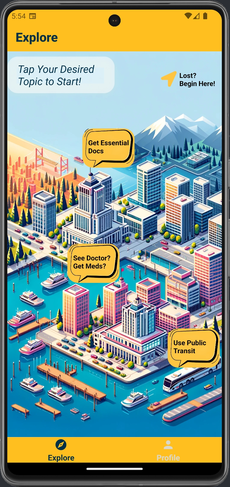
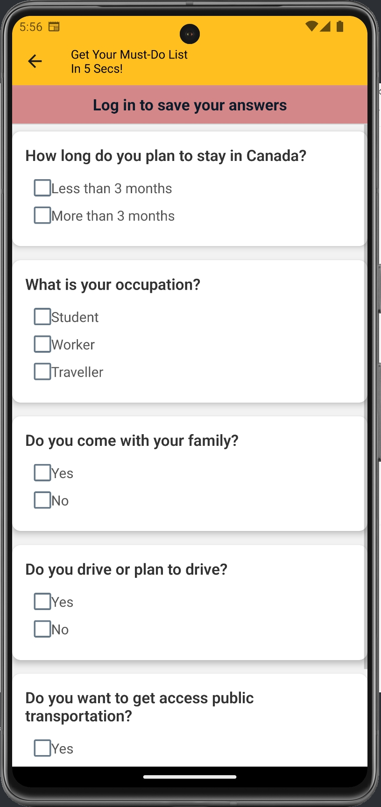

## JustArrive, a cross-platform mobile app

### Group Member:

Baozhang Min
Wenqian Xie

### App Description:

Welcome to JustArrive, your ultimate companion for a smooth transition into life in Canada. Whether you're a newcomer, international student, or a working professional, we've got you covered with all the essential information you need to make Canada your home.

### Slogan：

"Arrive as a local."

### Target Users：

Newcomers to Canada, including recent immigrants, international students, and working professionals.

### Run the app

`npm install`
`npx expo start`

### Features Overview

#### Tap desired topic to start on Home screen.

#### Select a specific item under each topic.

#### Browse curated details for quick insights. Click the links for more in-depth information.

#### If you're unsure where to start, answer a few simple questions and we'll generate a personalized to-do list with the essential information you need.

#### To save your to-do list or bookmark content for future reference, you can register. Your data will be automatically saved for future logins.

\*\* To meet project requirements for Firebase and ensure the app runs smoothly during testing, please upload your .env file.

==================================================================================================================================================
Development Log:

Iteration 1:
Screens:
Welcome Screen ->
Explore Screen -> Must do questionnaire -> Must do list
Profile Screen -> Log in/Sign up -> Reset Email/Password -> Log Out

We implemented a welcome screen which shows our App name and slogan, automatically swithced to Explore Screen.
In Explore Screen, we have a map with a couple entries (topics) for users to browse. In the right corner, we built a questionnaire and generate
customized must-do-list for users. In profile screen, users can log in, sign up or reset email/password. Users can also have access to the must-do-list in both Explore Screen and Profile Screen.

Our 3 data collections:

1. users:
   This includes username, email, userId and userSelections (it refers to the user's answer for the questionnaire)
2. bookmarks:
   This is the user's saved detailed pages such as how to get a SIN. It includes userId and according bookmarks.
3. details:
   This is the details of all contents that displayed in the different topics. It will include general topics like transport with subcollection like bike share.

==================================================================================================================================================
Iteration 2:

New Features:

- Add an interactive map at Details page to be configured further, which is accompanied with a "My Location" button to zoom the map properly so that the user's location could also be shown on the map.
- Add Avatar pic taking/picking and uploading function when the user is logged in. Avatar pic will be uploaded to firestore storage and its uri will be kept in the user Collection.
- Add More Navigation buttons in Entry Screens such as Medicine Entry, which will be used to navigate to corresponding Details Screen.

New Styles of:

- Welcome Screen
- Explore Screen
- Profile Screen
- Medicine Entry
- Transit Entry
- Essential Docs Entry

==================================================================================================================================================
Iteration 3:

New Features:

- Add unsplash image API to fetch random image of Canada and make the image as the background of sign up, log in and must-do-list pages.
- Add a notification in must-do-list so the user can view their tasks, and set up a time to send a notification for them. Also, when user clicked the notification, it will automatically switch to the details page.
- Add navigation in must-do-list so that when user click on the task, it will a
- Add external links in the details page so that when user click on them, it will direct user to the web.

Also, we adjusted all styles for all pages, filled the details page and uploaded all the data sets to firebase.
